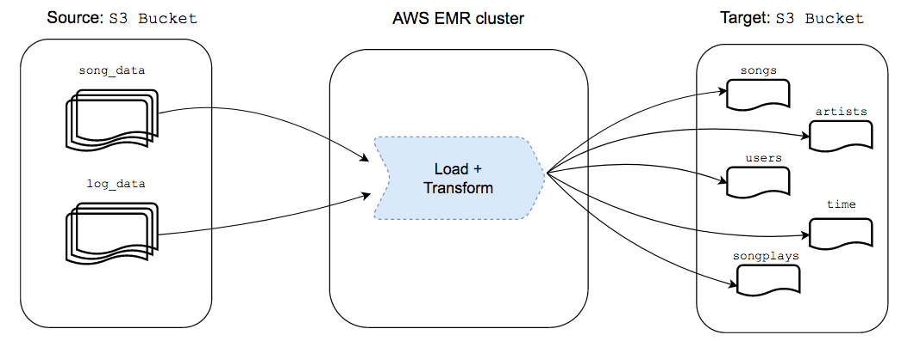
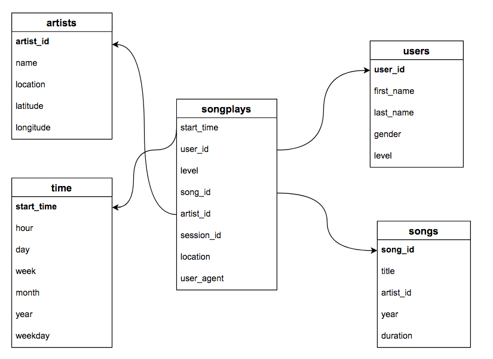

# Data Lake

## Objective

---

Build an ETL pipeline for a data lake of Sparkify's users activity from several **large** sources. This ETL pipeline processes data from S3 into analytics tables and loads them back into another S3 bucket.

## Implementation

---

### ETL pipeline

We are dealing with large amount of data and we have the need to transform it to allow further analysis. Below is explained this process.

##### Source
We have two sources that are stored in a AWS S3 bucket: 
- Songs Dataset: [Million Song Dataset](http://millionsongdataset.com/).
- Logs Dataset: Activity logs of users using the Sparkify app.

##### Extraction
The data was loaded it into a Spark cluster hosted in AWS EMR.


##### Transformation
The loaded data was transformed in the cluster using `PySpark`. Given that the *logs dataset* only have metadata about user's activity we must extract the information about songs from the *songs dataset*. The new tables were loaded into another AWS S3 bucket. 



The tables were structured with a star schema in mind for optimized for queries on song play analysis. The names of the songs provided on the *logs dataset* are used to create the *songs* and *artists* tables extracting the relevant information from the *songs dataset*. The attributes of users are stored in the *users* table. Finally, attributes regarding the time of logs are created and stored in the *time* table. The data warehouse have a star schema that simplifies queries and is used commonly for online analytics processing. The tables are as follows:

- Fact Table
    - `songplays`: Logs of songs plays 
    
- Dimension Tables
    - `users`: Contains users attributes
    - `songs`: Contains songs attributes
    - `artists`: Contains artists attributes
    - `time`: Contains time attributes

The structure of the created tables can be visualize as follows:


### Load

The tables were loaded into another S3 bucket in `parquet` file format. This in mind that the user will set the *Schema-on-Read*.

### Files

- `etl.py`: contains functions to process from AWS S3, transforms the data and then loads it back to another S3 bucket.

- `test.ipynb`: iPython notebook that can be used to load data and make queries on the loaded data.

## Instructions

---

1. Run `etl.py` to create database and tables

2. You can load the data and make queries from `test.ipynb`

> NOTE: Is assumed that connection configuration is on `dl.cfg` file

#### To run it on a AWS EMR cluster

1. Create EMR cluster with `spark`. Add an inbound rule to the security group of the master node that allows SSH connection with your IP address.

2. Load files to the cluster: `scp -i <PAIR_KEY.pem> etl.py hadoop@ec2-*-***-**-***.us-east-1.compute.amazonaws.com:/home/hadoop/` and `scp -i <PAIR_KEY.pem> dl.cfg hadoop@ec2-*-***-**-***.us-east-1.compute.amazonaws.com:/home/hadoop/`

3. Connecto to EMR cluster: `ssh -i <PAIR_KEY.pem> hadoop@ec2-*-***-**-***.us-east-1.compute.amazonaws.com`

4. [Optional] Depending of the Python version in the EMR cluster, the `configparser` Python library could not be imported. Thus, it is necessary to run the following: `sudo sed -i -e '$a\export PYSPARK_PYTHON=/usr/bin/python3' /etc/spark/conf/spark-env.sh`

5. Submit script to spark: `/usr/bin/spark-submit --master yarn etl.py`


## Query Examples

---

> Number of plays per location

```
SELECT location, COUNT(*) FROM songplays GROUP BY location;
```

> Number of plays per level of user

```
SELECT level, COUNT(*) FROM songplays GROUP BY level;
```